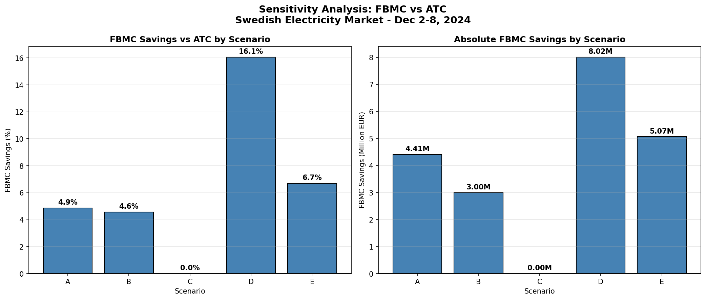

# Sensitivity Analysis Report
## FBMC vs ATC Comparison - Swedish Electricity Market
### December 2-8, 2024

---

## Executive Summary

This analysis tests the robustness of FBMC (Flow-Based Market Coupling) benefits
compared to ATC (Available Transfer Capacity) across 5 sensitivity scenarios.

**Base Case Result:** FBMC provides **6.54%** cost savings
(4,367,261 EUR) compared to ATC.

---

## Scenario Definitions

| Scenario | Name | Description |
|----------|------|-------------|
| Base | Real Dec 2024 Prices | ENTSO-E day-ahead prices for Dec 2-8, 2024 |
| A | High Continental (+30%) | DE, PL, DK1, DK2, LT prices +30% |
| B | Low Norwegian (-30%) | NO1, NO3, NO4 prices -30% |
| C | Price Convergence | All neighbors at 60 EUR/MWh |
| D | SE2-SE3 Reduced (-30%) | Internal bottleneck capacity reduced |
| E | Cross-Border +20% | All cross-border capacities +20% |

---

## Results Summary

| Scenario | FBMC Total (EUR) | ATC Total (EUR) | Savings (EUR) | Savings (%) |
|----------|------------------|-----------------|---------------|-------------|
| Base | -71,113,028 | -66,745,767 | 4,367,261 | 6.54% |
| A | -94,687,006 | -90,281,719 | 4,405,287 | 4.88% |
| B | -68,725,610 | -65,726,537 | 2,999,074 | 4.56% |
| C | -28,073,637 | -28,073,637 | 0 | 0.00% |
| D | -57,903,616 | -49,886,819 | 8,016,797 | 16.07% |
| E | -80,686,731 | -75,620,774 | 5,065,957 | 6.70% |

---

## Key Findings

### 1. Robustness of FBMC Benefits

**FBMC benefits vary:** 4/5 scenarios show positive savings.
Scenarios with no/negative savings: C

### 2. Most Impactful Parameter

**Highest FBMC Benefit:** Scenario D (Reduced SE2-SE3 Capacity (-30%))
- Savings: 16.07% (8,016,797 EUR)
- Interpretation: Tighter internal constraints increase the value of FBMC's ability to route power through cross-border paths.

**Lowest FBMC Benefit:** Scenario C (Price Convergence (60 EUR/MWh))
- Savings: 0.00% (0 EUR)
- Interpretation: Price convergence reduces arbitrage opportunities, limiting the value of FBMC's flow optimization.

### 3. When Does FBMC Benefit Disappear?

FBMC benefit disappears in Scenario C (Price Convergence (60 EUR/MWh)).
This occurs because price convergence eliminates arbitrage opportunities that FBMC exploits.

---

## Detailed Scenario Analysis

### Scenario A: High Continental Prices (+30%)

**Description:** DE, PL, DK1, DK2, LT prices increased by 30%

| Metric | FBMC | ATC | Difference |
|--------|------|-----|------------|
| Swedish Gen Cost | 31,348,923 EUR | 31,402,300 EUR | +53,377 EUR |
| Net Import Cost | -126,035,929 EUR | -121,684,019 EUR | +4,351,910 EUR |
| Total System Cost | -94,687,006 EUR | -90,281,719 EUR | +4,405,287 EUR |
| **Savings** | - | - | **4.88%** |

### Scenario B: Low Norwegian Prices (-30%)

**Description:** NO1, NO3, NO4 prices reduced by 30%

| Metric | FBMC | ATC | Difference |
|--------|------|-----|------------|
| Swedish Gen Cost | 28,962,988 EUR | 28,393,060 EUR | -569,928 EUR |
| Net Import Cost | -97,688,599 EUR | -94,119,597 EUR | +3,569,002 EUR |
| Total System Cost | -68,725,610 EUR | -65,726,537 EUR | +2,999,074 EUR |
| **Savings** | - | - | **4.56%** |

### Scenario C: Price Convergence (60 EUR/MWh)

**Description:** All neighbor prices set to 60 EUR/MWh

| Metric | FBMC | ATC | Difference |
|--------|------|-----|------------|
| Swedish Gen Cost | 37,352,454 EUR | 37,352,454 EUR | +0 EUR |
| Net Import Cost | -65,426,091 EUR | -65,426,091 EUR | +0 EUR |
| Total System Cost | -28,073,637 EUR | -28,073,637 EUR | +0 EUR |
| **Savings** | - | - | **0.00%** |

### Scenario D: Reduced SE2-SE3 Capacity (-30%)

**Description:** SE2-SE3 corridor capacity reduced by 30%

| Metric | FBMC | ATC | Difference |
|--------|------|-----|------------|
| Swedish Gen Cost | 32,273,629 EUR | 32,519,649 EUR | +246,019 EUR |
| Net Import Cost | -90,177,245 EUR | -82,406,467 EUR | +7,770,778 EUR |
| Total System Cost | -57,903,616 EUR | -49,886,819 EUR | +8,016,797 EUR |
| **Savings** | - | - | **16.07%** |

### Scenario E: Increased Cross-Border Capacity (+20%)

**Description:** All cross-border lines capacity increased by 20%

| Metric | FBMC | ATC | Difference |
|--------|------|-----|------------|
| Swedish Gen Cost | 33,962,103 EUR | 32,982,313 EUR | -979,790 EUR |
| Net Import Cost | -114,648,834 EUR | -108,603,087 EUR | +6,045,747 EUR |
| Total System Cost | -80,686,731 EUR | -75,620,774 EUR | +5,065,957 EUR |
| **Savings** | - | - | **6.70%** |

---

## Visualization

---

## Conclusions

1. **FBMC benefits are conditional** across the tested scenarios.

2. **Price spreads matter:** Higher continental prices (Scenario A) decrease FBMC benefits.

3. **Norwegian prices matter:** Lower Norwegian prices (Scenario B) decrease FBMC benefits.

4. **Price convergence:** When prices converge (Scenario C), FBMC savings diminish significantly.

5. **Internal constraints:** Tighter SE2-SE3 capacity (Scenario D) increases FBMC benefits.

6. **Cross-border capacity:** More cross-border capacity (Scenario E) increases FBMC benefits.

---

*Report generated: 2026-04-28 21:25:29*
